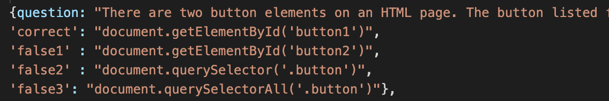
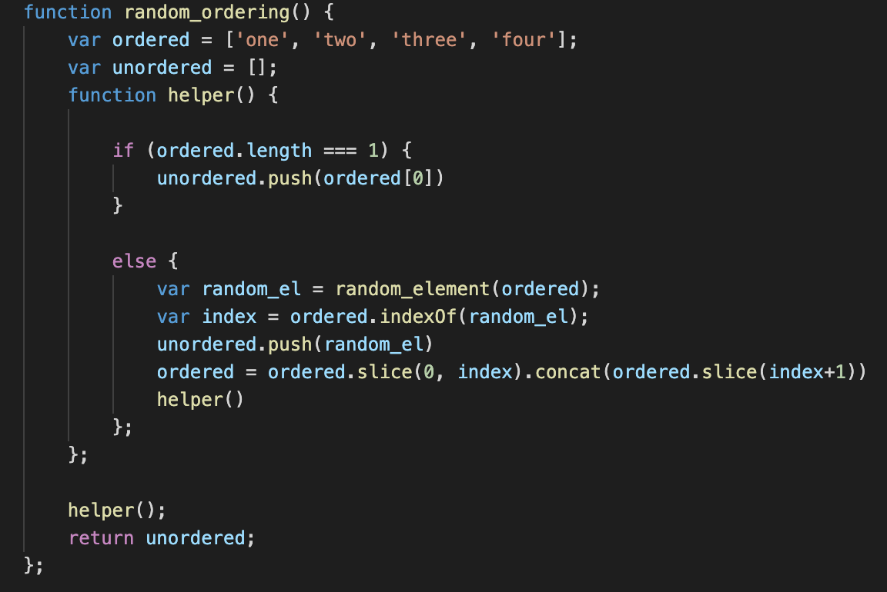
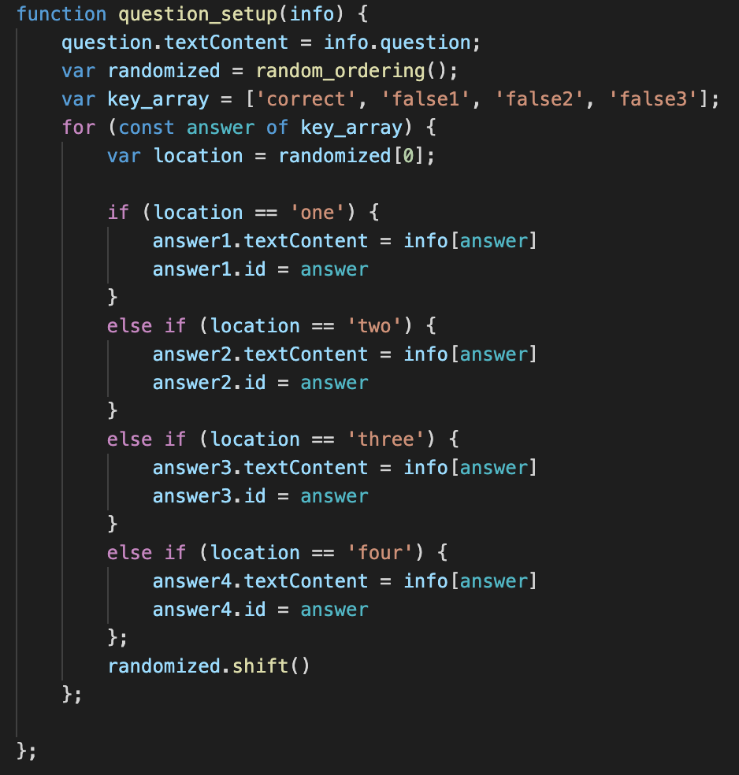

# Hw04_CodeQuiz

This project was to build from scratch a 'code quiz'. Questions would center on HTML, CSS, and Javascript code, and users could store highscores at the end. Because of the multiple displays between which to toggle, the variety of buttons to be functionalized, and the highscores to be stored, this project served as a rigorous introduction to using the DOM (document object model) to dynamically manipulate a website. The requirements were as follows:

When the user clicks start, a timer begins, and questions begin appearing, and a timer countdown is displayed. Each time a user selects an answer, they are alerted if the are correct or not. If the user answers all questions or runs out of time, their score is displayed. Once they submit their initials, their score and initials are stored on a highscores page displayed at the end. On this page, there is a button to restart the quiz, and a button to clear high scores. If multiple people take the quiz, all of their scores will be stored on the highscores page. At any point during the quiz, the user can select to exit the quiz and view highscores.

## Getting Started

These instructions will get you a copy of the project up and running on your local machine for development and testing purposes. See deployment for notes on how to deploy the project on a live system.

### Prerequisites

1. Install git by typing `git --version` in your terminal. If you are not sure if you have git or not, typing this will automatically prompt installation if you do not.

### Installing

To get access to this project for development and testing, go through the following steps:

1. Clone the project repository by navigating to a proper directory in terminal and typing `git clone https://github.com/GabeSucich/Hw04_CodeQuiz.git`:

2. Edit the javascript file, push to github, and see the live deployed website at the URL below.

## Built With

* [HTML](https://developer.mozilla.org/en-US/docs/Web/HTML)
* [CSS](https://developer.mozilla.org/en-US/docs/Web/CSS)
* [Javascript](https://developer.mozilla.org/en-US/docs/Web/JavaScript)

## Deployed Link

* [See Live Site](https://gabesucich.github.io/Hw04_CodeQuiz/)

## Integral Code

One of the more challenging portions of this code was, upon setup of each question, marking each button as 'correct' or 'incorrect'. This was accomplished (in part) through the following elements of code. The question-answer sets were stored as javascript objects where the keys were indicated the correctness of the answer.

Before each questions was to be displayed, a random ordering of the numbers one through four was generated. This randomized the ordering of the answers in each questions, so that there was not a patter in where correct answers appeared.

Finally, each answer choice in the javascript object was assigned sequentially to an answer choice from this random ordering, displaying a non-patterned set of answers for the user to select.

## Project Snapshots

### Gabriel Sucich

- [Portfolio coming soon!](#)
- [Link to Github](https://github.com/GabeSucich)
- [Link to LinkedIn](www.linkedin.com/in/gabriel-sucich-6a28a71a8)

See also the list of [contributors](https://github.com/GabeSucich/Hw0403_CodeQuiz/graphs/contributors) who participated in this project.

## Acknowledgments

* Thanks to Trilogy Education Services, a 2U, Inc for providing the instructions and example for this project.
* Big shout out to Manuel for the detailed walkthroughs of using mark down.